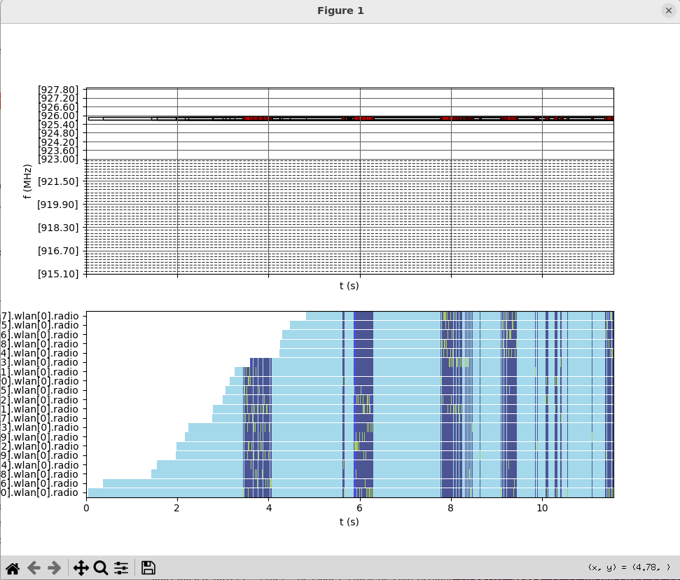

# LabSCim Simulator CSMA Contiki-NG Example Usage Guide

This guide provides step-by-step instructions to configure, run, and debug a simulation example for the CSMA Contiki-NG using LabSCim simulator. If you haven't done already, please follow the [installation guide](INSTALLATION.md).

### 1. Compile the `rpl-udp` Example
If you haven't done so already, compile the `rpl-udp` example from Contiki-NG for LabSCim:
```bash
cd $HOME/LabSCim/contiki-ng/examples/rpl-udp && make -j$(nproc) TARGET=labscim
```

### 2. Open OMNeT++
If OMNeT++ is not already open, start it with the following commands:
```bash
cd $HOME/LabSCim/omnetpp-6.0.3 && source setenv && omnetpp
```

### 3. Import the Example Project
If you haven't done so already, import the examle project.
To import the example project into OMNeT++:
1. Navigate to **File -> Import**.
2. Select **General -> Existing Projects into Workspace**.
3. Set the **Select root directory** field to:
   ```
   $HOME/LabSCim/labscim/
   ```
4. Click **Finish**.

### 4. Locate Simulation Configuration
The simulation configurations can be found in the file 'labscim/simulations/wireless/nic/labscim.ini'

### 5. Build and Debug the Project
To debug the project:
1. Click on the **Debug** icon in OMNeT++.
2. Select **OMNet++ Simulation**.
3. Select the configuration file 'labscim/simulations/wireless/nic/labscim.ini'.

### 6. Run the Simulation
After debugging, start the simulation by clicking on one of the **Play** icons available at the upper bar.

### 7. Access Simulation Logs
Once the simulation is complete, log files will be generated. These logs provide detailed information about the simulation.

### 8. Plot Spectrum Usage
To visualize the spectrum usage:
1. Close the simulation.
2. Navigate to the following directory:
   ```bash
   cd $HOME/LabSCim/models/labscim/src/spectrum_plotter
   ```
3. Run the spectrum plotter script with the command:
   ```bash
    python3 spectrum_plotter.py ../../simulations/wireless/nic/spectrumUsageLog.txt
   ```

### 9. View the Spectrum Plot
A window displaying the spectrum usage over time will open, providing insights into the simulation results:



