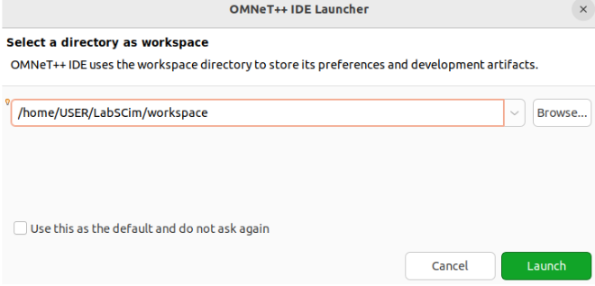

# Installation Guide for LabSCim Simulator

These installation steps have been verified on **Ubuntu 22.04 LTS**.

## Step 1: Download OMNeT++
Download the Linux version of OMNeT++ 6.0.3 from the [official website](https://omnetpp.org/download/old).

## Step 2: Update Ubuntu Repositories
Run the following command to update your Ubuntu repositories:
```bash
sudo add-apt-repository universe
sudo add-apt-repository multiverse
sudo apt update
```

## Step 3: Install Required Packages
Install the necessary packages for Ubuntu and Python with the following command:
```bash
sudo apt install -y build-essential clang lld gdb bison flex perl python3 python3-pip qtbase5-dev qtchooser qt5-qmake qtbase5-dev-tools libqt5opengl5-dev libxml2-dev zlib1g-dev doxygen graphviz libwebkit2gtk-4.0-37 xdg-utils cmake && python3 -m pip install --user --upgrade numpy pandas matplotlib scipy seaborn posix_ipc
```

## Step 4: Install 3D Visualization Package
Install the 3D visualization package:
```bash
sudo apt install libopenscenegraph-dev
```

## Step 5: Install MPI Packages
For parallel simulation, install MPI packages:
```bash
sudo apt install mpi-default-dev
```

## Step 6: Extract OMNeT++
Extract the downloaded OMNeT++ file into a directory under your home folder:
```bash
mkdir $HOME/LabSCim && tar xvfz omnetpp-6.0.3-linux-x86_64.tgz -C $HOME/LabSCim
```

## Step 7: Configure Environment Variables
Set up environment variables for OMNeT++:
```bash
source $HOME/LabSCim/omnetpp-6.0.3/setenv
```

## Step 8: Adjust Compiler and Linker Preferences
If you prefer to use GCC instead of Clang and the default linker instead of LLD (recommended), update the `configure.user` file in the OMNeT++ directory (`$HOME/LabSCim/omnetpp-6.0.3/configure.user`):

Edit the following lines in `$HOME/LabSCim/omnetpp-6.0.3/configure.user`:
```bash
PREFER_CLANG=no
PREFER_LLD=no
```

## Step 9: Run OMNeT++ Configuration Script
Run the configuration script to detect installed software and set up the system:
```bash
cd $HOME/LabSCim/omnetpp-6.0.3 && ./configure
```

## Step 10: Compile OMNeT++
Compile OMNeT++ (this may take a few minutes):
```bash
make -j$(nproc)
```

## Step 11: Launch OMNeT++
Open OMNeT++ with the following commands:
```bash
cd $HOME/LabSCim/omnetpp-6.0.3 && source setenv && omnetpp
```

## Step 12: Select Workspace Folder
Select a workspace folder (recommended: `workspace` in your home directory):




## Step 13: Install INET Framework
Use the menu "Help > Install Simulation Models..." in OMNeT++ to install the INET Framework 4 version 4.4.2. Set the "Project Name" to "inet". Click "Install Project" and wait for the installation to complete. Verify the installation in the "Project Explorer" and the console.

## Step 14: Install Additional Packages for LabSCim
Install the required Ubuntu packages for LabSCim:
```bash
sudo apt install -y git build-essential libssl-dev ninja-build software-properties-common lsb-release libcrypto++-dev libboost-all-dev libpaho-mqtt-dev
```

## Step 15: Clone LabSCim Repository
Clone the necessary LabSCim repositories:
```bash
mkdir $HOME/LabSCim/models && cd $HOME/LabSCim/models && git clone https://github.com/glmoritz/labscim.git
```

## Step 16: Fix Symbolic Links for LabSCim
Run the following commands to fix symbolic links:
```bash
cd $HOME/LabSCim/models/labscim/src/common && sudo chmod +x fix_symlinks.sh && ./fix_symlinks.sh
```

## Step 17: Create Symbolic Link for LabSCim
Create a symbolic link for the LabSCim folder:
```bash
ln -s $HOME/LabSCim/models/labscim/ $HOME/LabSCim/labscim
```

## Step 18: Clone Additional Repositories
Clone additional repositories required for LabSCim:
```bash
cd $HOME/LabSCim && git clone https://github.com/glmoritz/contiki-ng.git --recursive && git clone https://github.com/glmoritz/LoRaMac-node.git && git clone https://github.com/glmoritz/lora_gateway.git && git clone https://github.com/glmoritz/packet_forwarder.git
```

## Step 19: Fix Symbolic Links for LoRa Gateway
Run the following commands to fix symbolic links for the LoRa Gateway:
```bash
cd $HOME/LabSCim/lora_gateway && sudo chmod +x fix_symlinks.sh && ./fix_symlinks.sh
```

## Step 20: Compile LoRa Gateway
Compile the LoRa Gateway:
```bash
make -j$(nproc)
```

## Step 21: Fix Symbolic Links for Packet Forwarder
Run the following commands to fix symbolic links for the Packet Forwarder:
```bash
cd $HOME/LabSCim/packet_forwarder/lora_pkt_fwd/inc && sudo chmod +x fix_symlinks.sh && ./fix_symlinks.sh
```

## Step 22: Compile Packet Forwarder
Compile the Packet Forwarder:
```bash
cd $HOME/LabSCim/packet_forwarder && make -j$(nproc)
```

## Step 23: (Optional) Compile Contiki-NG Example
Compile the `simple-node` example from Contiki-NG:
```bash
cd $HOME/LabSCim/contiki-ng/examples/6tisch/simple-node && make -j$(nproc) TARGET=labscim
```

## Step 24: (Optional) Compile Contiki-NG UDP Example
Compile the UDP example from Contiki-NG:
```bash
cd $HOME/LabSCim/contiki-ng/examples/rpl-udp && make -j$(nproc) TARGET=labscim
```

## Step 25: Create Symbolic Link for INET Framework
Create a symbolic link for the INET Framework:
```bash
ln -s $HOME/LabSCim/workspace/inet/ $HOME/LabSCim/inet4.4
```

## Step 26: Compile INET Framework
Compile the INET Framework:
```bash
cd $HOME/LabSCim/inet4.4 && make -j$(nproc)
```

## Step 27: Compile LabSCim
Compile LabSCim with the following commands:
```bash
cd $HOME/LabSCim/models/labscim/src &&
source $HOME/LabSCim/omnetpp-6.0.3/setenv &&
$HOME/LabSCim/omnetpp-6.0.3/bin/opp_makemake -f --deep -KINET_PROJ=$HOME/LabSCim/inet4.4 -DINET_IMPORT -I$HOME/LabSCim/inet4.4/src -L$HOME/LabSCim/inet4.4/src -lboost_system -lcryptopp -lpthread -lrt -lINET && make -j$(nproc)
```

## Step 28: Fix Symbolic Links for LoRaMac-Node
Run the following commands to fix symbolic links for LoRaMac-Node:
```bash
cd $HOME/LabSCim/LoRaMac-node/src/boards/labscim && sudo chmod +x fix_symlinks.sh && ./fix_symlinks.sh
```

## Step 29: Generate Build Configuration for LoRaMac-Node
Generate the build configuration for LoRaMac-Node:
```bash
cd $HOME/LabSCim/LoRaMac-node/ && cmake -DCMAKE_BUILD_TYPE:STRING=Release -DAPPLICATION:STRING=LoRaMac -DSUB_PROJECT:STRING=periodic-uplink-lpp -DLORAWAN_DEFAULT_CLASS:STRING=CLASS_A -DCLASSB_ENABLED:STRING=ON -DACTIVE_REGION:STRING=LORAMAC_REGION_AU915 -DMODULATION:STRING=LORA -DBOARD:STRING=labscim -DMBED_RADIO_SHIELD:STRING=LABSCIM_SHIELD -DLORAMAC_LR_FHSS_IS_ON:STRING=ON -DSECURE_ELEMENT:STRING=SOFT_SE -DSECURE_ELEMENT_PRE_PROVISIONED:STRING=OFF -DREGION_EU868:STRING=ON -DREGION_US915:STRING=OFF -DREGION_CN779:STRING=OFF -DREGION_EU433:STRING=OFF -DREGION_AU915:STRING=ON -DREGION_CN470:STRING=OFF -DREGION_AS923:STRING=OFF -DREGION_KR920:STRING=OFF -DREGION_IN865:STRING=OFF -DREGION_RU864:STRING=OFF -DREGION_AS923_DEFAULT_CHANNEL_PLAN:STRING=CHANNEL_PLAN_GROUP_AS923_1 -DREGION_CN470_DEFAULT_CHANNEL_PLAN:STRING=CHANNEL_PLAN_20MHZ_TYPE_A -DUSE_RADIO_DEBUG:STRING=OFF -DCMAKE_EXPORT_COMPILE_COMMANDS:BOOL=TRUE -DCMAKE_C_COMPILER:FILEPATH=/usr/bin/gcc -DCMAKE_CXX_COMPILER:FILEPATH=/usr/bin/g++ -S$HOME/LabSCim/LoRaMac-node/ -B$HOME/LabSCim/LoRaMac-node/build -G Ninja
```

## Step 30: Compile LoRaMac-Node
Compile the LoRaMac-Node with Ninja:
```bash
cd $HOME/LabSCim/LoRaMac-node/build && ninja
```

## Step 31: Launch OMNeT++
Open OMNeT++:
```bash
cd $HOME/LabSCim/omnetpp-6.0.3 && source setenv && omnetpp
```

## Step 32: Select Workspace and Finalize
Select the `workspace` folder.


## Next steps

In order to run an example code, see the [CSMA Contiki-NG example](EXAMPLE_CSMA_CONTIKI.md).


